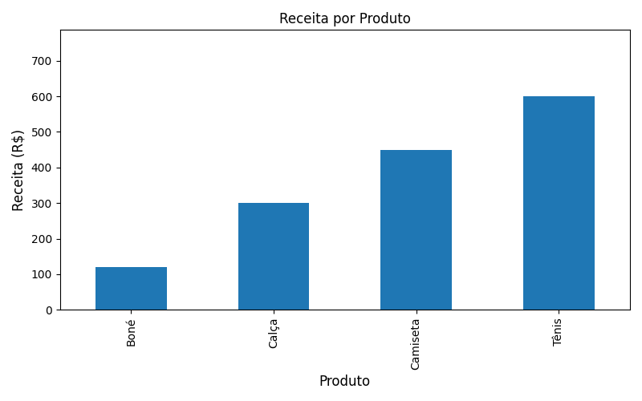

# Análise de Vendas

Este projeto tem como objetivo analisar os dados de vendas de produtos, identificando a receita por item vendido e por mês, com base em um arquivo CSV.

## 📁 Estrutura do Projeto

- `dados_vendas.csv`: conjunto de dados simulando vendas (data, produto, quantidade, preço unitário).
- `analise.py`: script em Python que faz o tratamento dos dados e gera os gráficos.
- `assets/`: imagens geradas pelos gráficos.

## 📊 Visualizações

### Receita por Produto

## 🚀 Como executar

1. Clonar o repositório
2. Abrir a pasta no VS Code
3. Executar `analise.py` com Python instalado

